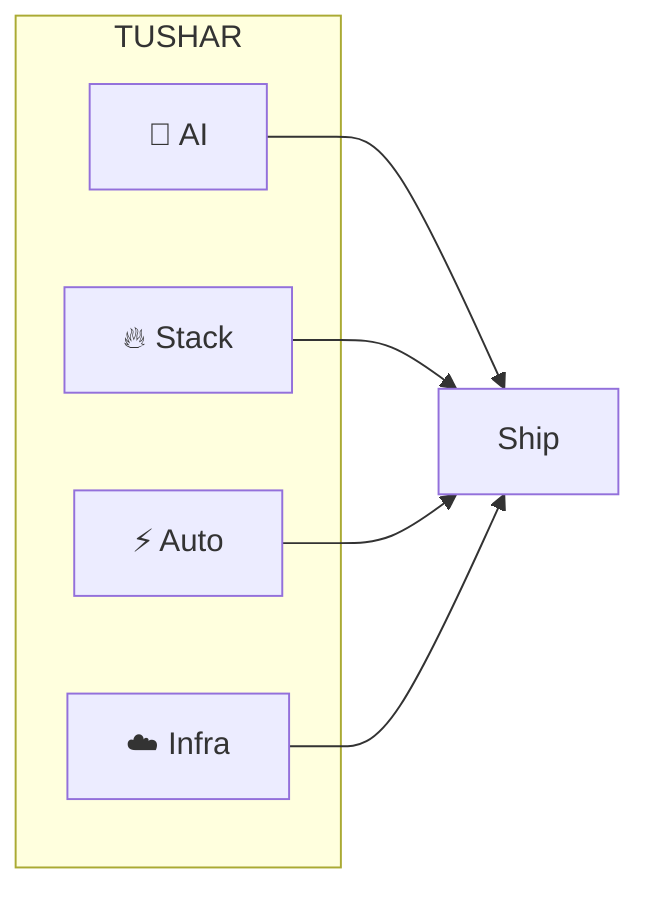

<div align="center">

<!-- ═══════════════════════════════════════════════════════════════════ -->
<!--  HACKER THEME — MATRIX GREEN + ANIMATIONS  -->
<!-- ═══════════════════════════════════════════════════════════════════ -->

<!-- Scanning / boot style banner -->


<!-- "System" typing - fast for hacker feel -->
<p align="center">
  
</p>

<!-- Main tagline - green -->
<p align="center">
  
</p>

<!-- Secondary "terminal" animation -->
<p align="center">
  
</p>

<!-- Badges - hacker green -->
<p align="center">
  
  
  
</p>

<!-- Social -->
<p align="center">
  <a href="https://www.linkedin.com/in/YOUR_LINKEDIN"></a>
  &nbsp;
  <a href="mailto:YOUR_EMAIL"></a>
  &nbsp;
  <a href="https://github.com/TusharND12"></a>
</p>

<!-- Animated divider 1 - gradient -->


</div>

<br/>

<!-- ═══════════════════════════════════════════════════════════════════ -->
<!--  [DATA] THE VISION  -->
<!-- ═══════════════════════════════════════════════════════════════════ -->

<div align="center">

### <code>[DATA]</code> The Vision

</div>

<table width="100%">
<tr>
<td width="52%" valign="top">

```javascript
// profile.js — Tushar
const config = {
  role: "Full Stack × AI",
  mantra: "Build systems. Not features.",
  mission: "Ideas → Intelligence",
  approach: [
    "Code with intent",
    "Automate the boring",
    "Scale before you need to",
    "Ship, then refine"
  ]
};
// Every system: automated · secure · scalable · AI-native
```

</td>
<td width="48%" valign="top">

<br/>

**Core**

| | |
|:--|:--|
| ⚡ | **Automated** — minimal human touch |
| 🔒 | **Secure** — by design |
| 📈 | **Scalable** — built for 10x |
| 🧠 | **AI-native** — intelligence in the stack |

<br/>

> *"The best code writes itself. The best systems think."*

</td>
</tr>
</table>

<br/>

<!-- Animated divider 2 -->
<p align="center">
  
</p>

<br/>

<!-- ═══════════════════════════════════════════════════════════════════ -->
<!--  [NETWORK] WHAT I BUILD  -->
<!-- ═══════════════════════════════════════════════════════════════════ -->

<div align="center">

### <code>[NETWORK]</code> What I Build

</div>

<table width="100%">
<tr>
<td width="50%" align="center" valign="top">

#### 🤖 AI & Agents


LLMs · RAG · multi-agent · orchestration  
*Decide → Execute → Deploy*

<code>OpenAI</code> <code>Claude</code> <code>LangChain</code> <code>RAG</code>

</td>
<td width="50%" align="center" valign="top">

#### 🔥 Full Stack


React · Node · Firebase · APIs  
*Frontend → Backend → Cloud*

<code>React</code> <code>Node.js</code> <code>Firebase</code> <code>TypeScript</code>

</td>
</tr>
<tr>
<td width="50%" align="center" valign="top">

#### ⚡ Automation


Pipelines · webhooks · n8n · events  
*Zero-touch workflows*

<code>n8n</code> <code>Webhooks</code> <code>API</code>

</td>
<td width="50%" align="center" valign="top">

#### ☁️ Infrastructure


AWS · GCP · Docker · serverless  
*Ship and scale*

<code>AWS</code> <code>GCP</code> <code>Docker</code> <code>Serverless</code>

</td>
</tr>
</table>

<br/>

<!-- Scanning line again -->
<p align="center">
  
</p>

<br/>

<!-- ═══════════════════════════════════════════════════════════════════ -->
<!--  [STACK] TECH  -->
<!-- ═══════════════════════════════════════════════════════════════════ -->

<div align="center">

### <code>[STACK]</code> Tech

</div>

<p align="center">
  <strong>AI & ML</strong><br/>
  
  
  
  
</p>

<p align="center">
  <strong>Frontend & Backend</strong><br/>
  
</p>

<p align="center">
  <strong>Cloud & Data</strong><br/>
  
</p>

<br/>

<!-- ═══════════════════════════════════════════════════════════════════ -->
<!--  [STATS] GITHUB  -->
<!-- ═══════════════════════════════════════════════════════════════════ -->

<div align="center">

### <code>[STATS]</code> GitHub

</div>

<p align="center">
  
  
</p>

<p align="center">
  
</p>

<br/>

<!-- ═══════════════════════════════════════════════════════════════════ -->
<!--  [ROOT] FOCUS  -->
<!-- ═══════════════════════════════════════════════════════════════════ -->

<div align="center">

### <code>[ROOT]</code> Current Focus

</div>



<br/>

<!-- Another typing animation -->
<p align="center">
  
</p>

<br/>

<!-- ═══════════════════════════════════════════════════════════════════ -->
<!--  [SYS] EXPERTISE  -->
<!-- ═══════════════════════════════════════════════════════════════════ -->

<div align="center">

### <code>[SYS]</code> Expertise

<table>
<tr>
<td align="center" width="25%">
<br/>

<br/><br/>
<b>🤖 AI</b><br/>
<sub>Systems that think & execute</sub>
<br/><br/>
</td>
<td align="center" width="25%">
<br/>

<br/><br/>
<b>🔥 Full Stack</b><br/>
<sub>End-to-end web & APIs</sub>
<br/><br/>
</td>
<td align="center" width="25%">
<br/>

<br/><br/>
<b>⚡ Automation</b><br/>
<sub>Zero-touch workflows</sub>
<br/><br/>
</td>
<td align="center" width="25%">
<br/>

<br/><br/>
<b>☁️ Cloud</b><br/>
<sub>Scalable infrastructure</sub>
<br/><br/>
</td>
</tr>
</table>

</div>

<br/>

<!-- ═══════════════════════════════════════════════════════════════════ -->
<!--  [CONNECT]  -->
<!-- ═══════════════════════════════════════════════════════════════════ -->

<div align="center">

### <code>[CONNECT]</code> Let's Build


<br/>

**Open to:** AI products · SaaS · automation · web apps · infrastructure

<br/><br/>

<a href="mailto:YOUR_EMAIL"></a>
&nbsp;
<a href="https://www.linkedin.com/in/YOUR_LINKEDIN"></a>
&nbsp;
<a href="https://github.com/TusharND12"></a>

</div>

<br/>

<!-- ═══════════════════════════════════════════════════════════════════ -->
<!--  FOOTER — SESSION ACTIVE  -->
<!-- ═══════════════════════════════════════════════════════════════════ -->

<div align="center">

<p align="center">
  
</p>

<br/>

**<span style="color:#00FF41">[Tushar](https://github.com/TusharND12)</span> — building tomorrow's systems today**

<br/>


<sub style="color:#00FF41">root@github ~ connection secure</sub>

</div>
