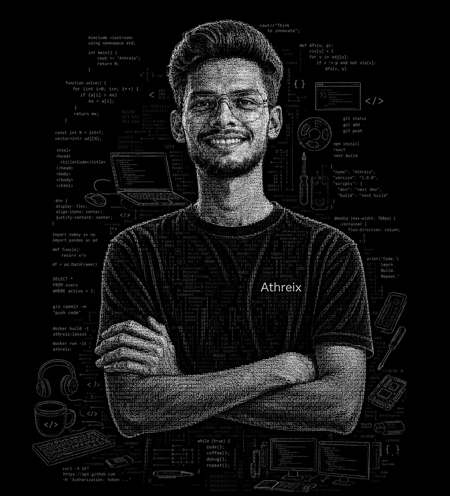

<!-- ═══════════════════════════════════════════════════════════════════════
     TUSHAR · GitHub Profile README
     Cinematic Developer Portfolio — Not a template.
     ═══════════════════════════════════════════════════════════════════════ -->

<!-- ─── ANIMATED GRADIENT HEADER ─────────────────────────────────────── -->

<div align="center">


</div>

<!-- ─── HERO SECTION — YOUR ATHREIX PORTRAIT ──────────────────────── -->

<div align="center">



<br/>
<br/>

<p align="center">
  
</p>

<p align="center">
  <a href="https://www.linkedin.com/in/tushar-dhokane12"></a>
  &nbsp;
  <a href="mailto:tushardhokane12@gmail.com"></a>
  &nbsp;
  <a href="https://github.com/TusharND12"></a>
  &nbsp;
  
</p>


</div>

<br/>

<!-- ─── ABOUT ME — COMPACT IDENTITY ──────────────────────────────── -->

<div align="center">

### <code>$ cat /etc/tushar</code>

</div>

```json
{
  "name": "Tushar Dhokane",
  "handle": "TusharND12",
  "role": "Full Stack Developer · ML Engineer",
  "location": "India 🇮🇳",
  "education": "Computer Engineering",
  "focus": ["Web Apps", "Machine Learning", "Real-time Systems"],
  "mantra": "Build → Ship → Iterate",
  "available": true,
  "open_to": ["Collaboration", "Full-time", "Freelance", "Open Source"]
}
```

<br/>

<!-- ─── TECH STACK — ANIMATED SKILL ICONS ────────────────────────── -->

<div align="center">

### <code>$ ls ~/.stack</code>

<p align="center">
  
</p>

<p align="center">
  
</p>
<p align="center">
  
</p>

</div>

<br/>


<br/>

<!-- ─── GITHUB STATS — 3-PANEL DASHBOARD ─────────────────────────── -->

<div align="center">

### <code>$ top</code> — GitHub stats

<p align="center">
  
</p>

<p align="center">
  
  &nbsp;&nbsp;
  
</p>

<p align="center">
  
</p>

</div>

<br/>

<!-- ─── GITHUB TROPHIES ──────────────────────────────────────────── -->

<div align="center">

### <code>🏆 Achievements</code>

<p align="center">
  
</p>

</div>

<br/>

<!-- ─── CONTRIBUTION SNAKE ───────────────────────────────────────── -->

<div align="center">

### <code>🐍 Contribution Snake</code>

<picture>
  <source media="(prefers-color-scheme: dark)" srcset="https://github.com/TusharND12/TusharND12/blob/output/github-snake-dark.svg" />
  <source media="(prefers-color-scheme: light)" srcset="https://github.com/TusharND12/TusharND12/blob/output/github-snake.svg" />
  
</picture>

</div>

<br/>

<!-- ─── ACTIVITY GRAPH ───────────────────────────────────────────── -->

<div align="center">

<p align="center">
  
</p>

</div>

<br/>


<br/>

<!-- ─── FEATURED PROJECTS ────────────────────────────────────────── -->

<div align="center">

### <code>📁 Featured Projects</code>

<p align="center">
  
</p>

<p align="center">
  <a href="https://github.com/TusharND12/Bynry-case-study"></a>
  &nbsp;
  <a href="https://github.com/TusharND12/chat-app"></a>
</p>

<p align="center">
  <a href="https://github.com/TusharND12/Power_Fault_Detection"></a>
  &nbsp;
  <a href="https://github.com/TusharND12/SecureView"></a>
</p>

</div>

<br/>


<br/>

<!-- ─── CONNECT ──────────────────────────────────────────────────── -->

<div align="center">

### <code>$ ssh tushar@connect</code>

<p align="center">
  
</p>

<p align="center">
  <a href="mailto:tushardhokane12@gmail.com"></a>
  &nbsp;
  <a href="https://www.linkedin.com/in/tushar-dhokane12"></a>
  &nbsp;
  <a href="https://github.com/TusharND12"></a>
</p>

<p align="center">
  <strong>Open to:</strong> Full Stack projects · ML pipelines · Real-time apps · Collabs · Hire
</p>

</div>

<br/>

<!-- ─── CINEMATIC FOOTER ─────────────────────────────────────────── -->

<div align="center">

<p align="center">
  
</p>

<p align="center">
  <strong><a href="https://github.com/TusharND12">Tushar Dhokane</a></strong> — Full Stack · ML · Real-time · India 🇮🇳
</p>


<sub><code>$ exit 0</code></sub>

</div>
