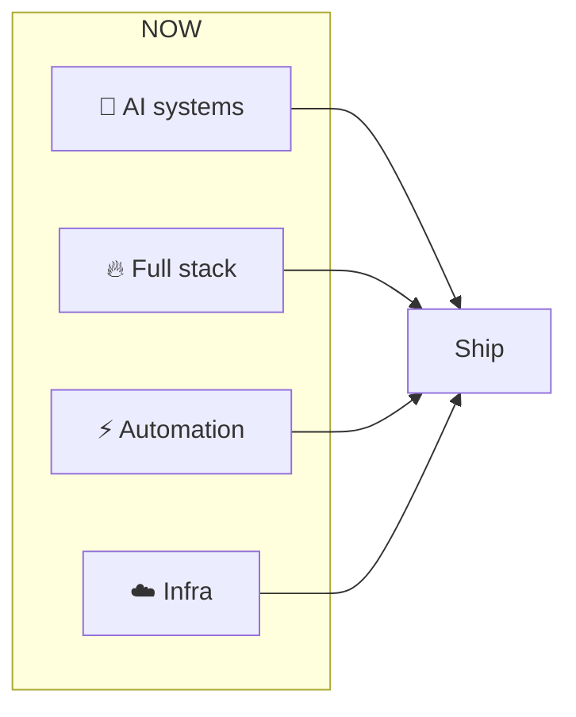

<p align="center">
  
</p>

```
╔══════════════════════════════════════════════════════════════════════════════╗
║  tushar@github:~$ whoami                                                    ║
║  TUSHAR                                                                      ║
║  ─────────────────────────────────────────────────────────────────────────  ║
║  Full Stack × AI × Systems   │   Building what doesn't exist yet             ║
╚══════════════════════════════════════════════════════════════════════════════╝
```

<p align="center">
  
</p>

<p align="center">
  
  
  
</p>

<p align="center">
  <a href="https://www.linkedin.com/in/YOUR_LINKEDIN"></a>
  <a href="mailto:YOUR_EMAIL"></a>
  <a href="https://github.com/TusharND12"></a>
</p>

---

```
tushar@github:~$ cat .profile
```

<table>
<tr>
<td width="55%" valign="top">

```bash
# Tushar — profile
export ROLE="Full Stack × AI"
export MANTRA="Build systems. Not features."
export APPROACH=(
  "Code with intent"
  "Automate the boring"
  "Scale before you need to"
  "Ship, then refine"
)

# Philosophy
echo "Every system: automated · secure · scalable · AI-native"
# "The best code writes itself. The best systems think."
```

</td>
<td width="45%" valign="top">

**Core**

- **Automated** — minimal human touch
- **Secure** — by design, not afterthought
- **Scalable** — built for 10x
- **AI-native** — intelligence in the stack

</td>
</tr>
</table>

---

```
tushar@github:~$ ls -la ./builds/
```

| | |
|:---:|:---:|
| **AI & agents** | **Full stack** |
| LLMs · RAG · multi-agent · orchestration | React · Node · Firebase · APIs |
| *Decide → Execute → Deploy* | *Frontend → Backend → Cloud* |
| **Automation** | **Infrastructure** |
| Pipelines · webhooks · n8n · events | AWS · GCP · Docker · serverless |
| *Zero-touch workflows* | *Ship and scale* |

---

```
tushar@github:~$ echo $TECH_STACK
```

<p align="center">
  <strong>AI/ML</strong><br/>
  
  
  
  
</p>

<p align="center">
  <strong>Stack</strong><br/>
  
  
</p>

<p align="center">
  <strong>Backend & cloud</strong><br/>
  
</p>

---

```
tushar@github:~$ ./contributions.sh
```

<p align="center">
  
</p>

---

```
tushar@github:~$ cat focus.mermaid
```



---

```
tushar@github:~$ ./connect.sh
```

<p align="center">
  <strong>Open to:</strong> AI products · SaaS · automation · web apps · infra
</p>

<p align="center">
  <a href="mailto:YOUR_EMAIL"></a>
  <a href="https://www.linkedin.com/in/YOUR_LINKEDIN"></a>
  <a href="https://github.com/TusharND12"></a>
</p>

<p align="center">
  
</p>

<p align="center">
  
</p>

<p align="center">
  <sub>tushar@github — connection active</sub>
</p>
