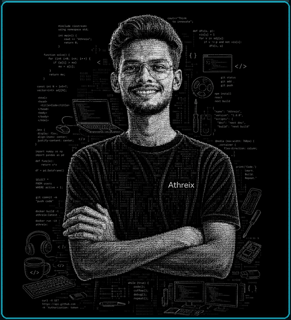
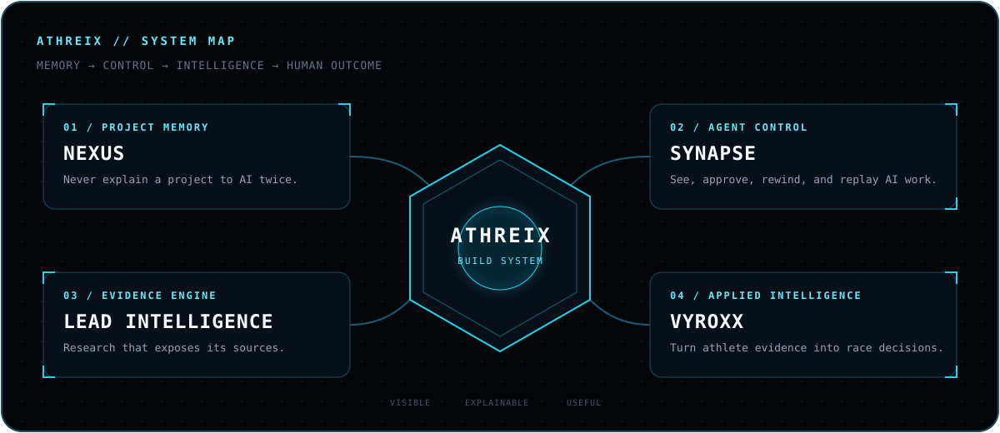

<!--
  TUSHAR // HUMAN SOURCE FILE
  Original portrait and Athreix system artwork belong to this profile.
  Built as one visual story: identity → method → systems → proof → contact.
-->

  

### I turn complex workflows into systems people can actually use.

  Full-stack developer and ML builder working where
  <strong>AI, product engineering, real-time software, and local-first tools</strong> meet.

  
  
  
  

<code>INDIA · COMPUTER ENGINEERING · BUILD → SHIP → ITERATE</code>

 

## `// READ ME AS A SYSTEM`

<table>
  <tr>
    <td width="25%" valign="top">
      <code>01 / OBSERVE</code>  
      Find the part of a messy problem that actually costs people time, trust, or clarity.
    </td>
    <td width="25%" valign="top">
      <code>02 / MODEL</code>  
      Turn the workflow into evidence, states, decisions, and honest constraints.
    </td>
    <td width="25%" valign="top">
      <code>03 / ENGINEER</code>  
      Connect product design, full-stack systems, data, and machine intelligence.
    </td>
    <td width="25%" valign="top">
      <code>04 / SHIP</code>  
      Make it usable, observable, reversible—and real enough to learn from.
    </td>
  </tr>
</table>

> **My build rule:** intelligence should expose its evidence, automation should leave the human in control, and ambitious ideas should end as usable products.

 

## `// THE ATHREIX CONSTELLATION`

  

<table>
  <tr>
    <td width="50%" valign="top">
      <h3>01 — <a href="https://github.com/TusharND12/Athriex-Nexus">Athreix Nexus</a></h3>
      
<code>RUST · LOCAL-FIRST · CLI</code>

      
<strong>Never explain your project to an AI twice.</strong> A persistent memory layer that records architecture, decisions, timelines, handoffs, and project knowledge—offline.

      <a href="https://github.com/TusharND12/Athriex-Nexus">Explore the memory layer →</a>
    </td>
    <td width="50%" valign="top">
      <h3>02 — <a href="https://github.com/TusharND12/athreix-synapse">Synapse</a></h3>
      
<code>RUST · TUI · OFFLINE</code>

      
<strong>A terminal-native control room for AI coding agents.</strong> Observe live work, inspect diffs, enforce guardrails, create checkpoints, and rewind changes.

      <a href="https://github.com/TusharND12/athreix-synapse">Enter the control room →</a>
    </td>
  </tr>
  <tr>
    <td width="50%" valign="top">
      <h3>03 — <a href="https://github.com/TusharND12/Athreix-outreach-saas">Athreix Lead Intelligence</a></h3>
      
<code>TYPESCRIPT · NEXT.JS · AI WORKFLOWS</code>

      
<strong>Research that shows its work.</strong> An AI-native platform for evidence-backed company research, buying-signal detection, qualification, strategy, and outreach drafts.

      <a href="https://github.com/TusharND12/Athreix-outreach-saas">Inspect the intelligence engine →</a>
    </td>
    <td width="50%" valign="top">
      <h3>04 — <a href="https://github.com/TusharND12/Vyroxx">VYROXX</a></h3>
      
<code>PRODUCT PROTOTYPE · PERFORMANCE INTELLIGENCE</code>

      
<strong>From athlete evidence to race decisions.</strong> Benchmarking, prediction, pacing, causal race replay, and training prescriptions in one mobile-first interface.

      <a href="https://tusharnd12.github.io/Vyroxx/">Open the live product ↗</a>
      &nbsp;·&nbsp;
      <a href="https://github.com/TusharND12/Vyroxx">Source →</a>
    </td>
  </tr>
</table>

 

## `// ENGINEERING DNA`

<table>
  <tr>
    <td width="25%" valign="top"><code>LANGUAGES</code>  Rust · TypeScript · JavaScript · Python · Java</td>
    <td width="25%" valign="top"><code>PRODUCT</code>  React · Next.js · Tailwind · responsive interfaces</td>
    <td width="25%" valign="top"><code>SYSTEMS</code>  Node.js · Firebase · MongoDB · Redis · Convex</td>
    <td width="25%" valign="top"><code>INTELLIGENCE</code>  TensorFlow · structured AI workflows · evidence-first UX</td>
  </tr>
</table>

 

## `// LIVE TELEMETRY`

  
<strong>Open the public build signal</strong>

   
  

    
  

 

## `// OPEN A CHANNEL`

### One good conversation can become the next useful system.

If you are building an AI-native product, a developer tool, a real-time experience,
or a workflow that needs both systems thinking and a usable interface, let’s talk.

  
  

 

<code>tushar@athreix:~$ build --something-useful</code>

  

Designed as a system—not assembled as a template.

